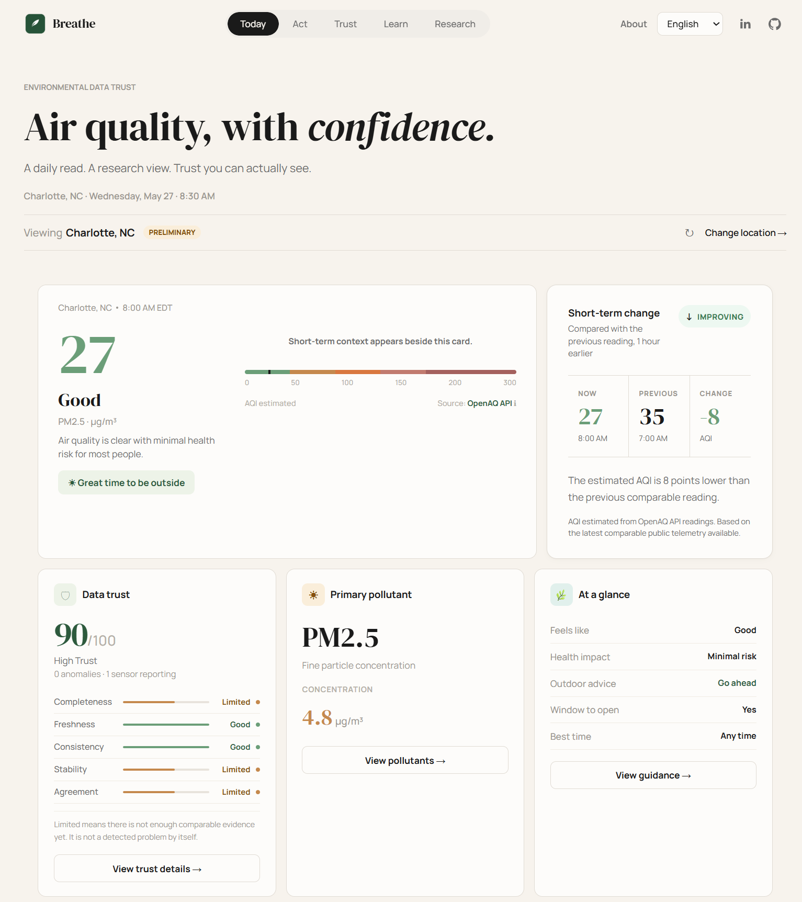
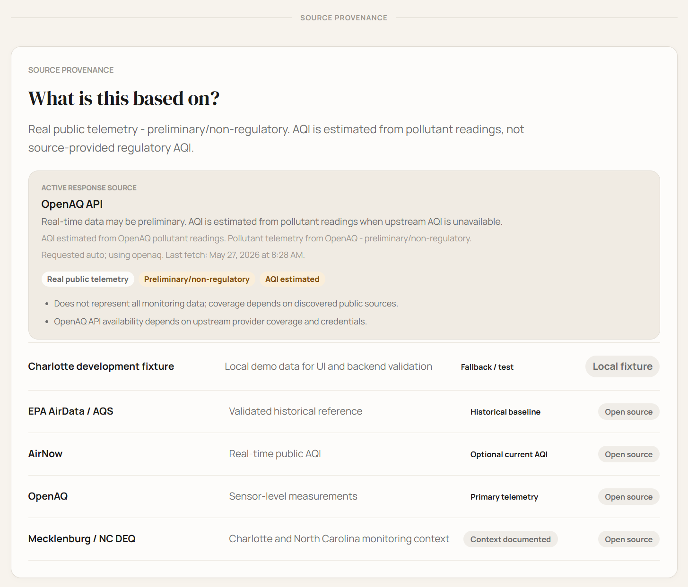
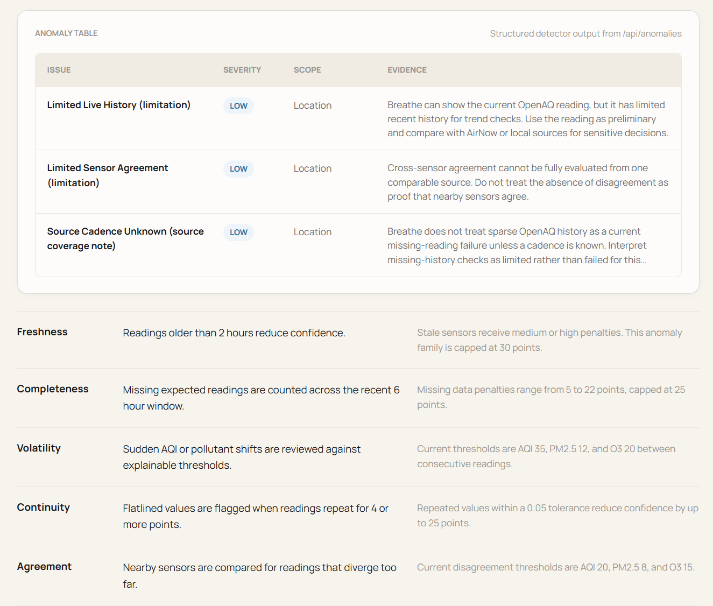

# Breathe

**Trust-aware environmental telemetry for public air-quality dashboards.**

Breathe is a deployed environmental data trust platform that shows local air-quality conditions while also explaining whether the telemetry behind those conditions appears fresh, complete, internally consistent, and clearly sourced.

This is a public showcase repository for the project. The production source code is private, but recruiters, researchers, or interested collaborators are welcome to reach out if they would like to review the implementation in more detail.

## Live Demo

- https://breatheair.duckdns.org

## Research Paper

- https://drive.google.com/file/d/1yPWx-7FPtVY5ceHw9v7k2Gp0qzATHuAj/view?usp=sharing

## Medium Article

- https://medium.com/@btayl106/breathe-communicating-trust-in-public-air-quality-data-21114ad1d5b5

## Project Summary

Most air-quality dashboards show a single number, usually AQI.

Breathe asks a second question:

**How trustworthy is the data behind that number right now?**

The platform combines a public-facing dashboard with a research-style trust layer. It helps users understand current air-quality conditions while also surfacing data-quality signals such as missing readings, stale updates, sudden changes, flatlines, source limitations, and disagreement between sensors or providers.

Breathe is a research prototype, not an official public-health, regulatory, medical, or emergency guidance system. Its trust score describes **data quality confidence**, not whether the air is safe.


## Project Summary

Most air-quality dashboards show a single number, usually AQI.

Breathe asks a second question:

**How trustworthy is the data behind that number right now?**

The platform combines a public-facing dashboard with a research-style trust layer. It helps users understand current air-quality conditions while also surfacing data-quality signals such as missing readings, stale updates, sudden changes, flatlines, and disagreement between sources.

Breathe is a research prototype, not an official public-health, regulatory, medical, or emergency guidance system. Its trust score describes data quality confidence, not whether the air is safe.

## Key Results

In a controlled demo/evaluation run, Breathe:

* Analyzed **144 pollutant readings**
* Detected **7.6% missing readings**
* Flagged **2.1% stale updates**
* Identified **20.8% source disagreement** across comparable time windows
* Measured a **27-point trust score drop** after simulated telemetry issues
* Passed **9/9 controlled anomaly scenarios** in the evaluation runner
* Reported **12 true positives, 0 false positives, and 0 false negatives** in controlled scenario testing

## Features

* **Today View:** current AQI, pollutant context, plain-language guidance, and source labeling
* **Community/Action View:** exposure-aware recommendations and clean-air-adjacent actions
* **Trust View:** data trust score, source provenance, anomaly evidence, and score reasoning
* **Research View:** detector traces, source audit details, anomaly tables, and research-oriented evidence
* **Simulation Controls:** controlled scenarios for missing readings, sensor silence, spikes, replayed values, and fake-normal behavior
* **Forensic-Style Reports:** generated report snapshots with location, time range, source limitations, trust score, anomalies, dataset hash, and next steps
* **Location Selection:** Charlotte-first implementation with coordinate-based place selection and no-data handling
* **Reproducible Evaluation:** controlled scenario runner exporting JSON, Markdown, and CSV results

## Research Question

**How can public environmental systems communicate air-quality risk, data trustworthiness, and ethical clean-air action without overstating what preliminary or prototype data can prove?**

Breathe explores this question through normalized telemetry modeling, modular ingestion, rule-based anomaly detection, explainable scoring, controlled simulation, and cloud-deployed application design.

## Project Preview

### Dashboard Overview



Main dashboard view showing local air quality, AQI status, plain-language guidance, pollutant context, and the data trust layer.

---

### Data Trust Score Methodology



Trust analysis view showing how Breathe evaluates telemetry reliability using freshness, completeness, source consistency, anomaly evidence, and explainable scoring.

---

### Anomaly Signals and Evidence Trail



Research-oriented view highlighting detected data quality signals, including missing readings, stale updates, source disagreement, spikes, flatlines, and other telemetry patterns.

## System Overview

```text
User browser
  |
  v
React/Vite frontend
  |  Today / Act / Trust / Research / Location picker
  v
FastAPI backend
  |  current conditions, timelines, anomalies, reports, simulations
  v
Source selection and ingestion
  |  OpenAQ / AirNow / EPA AirData-AQS / labeled fixture fallback
  v
Normalized telemetry model
  |  source, sensor, pollutant, value, unit, timestamp, coordinates,
  |  raw metadata, quality flags, simulation fields
  v
Anomaly detection + trust scoring
  |  freshness, completeness, volatility, continuity, agreement
  v
API responses, reports, research traces, and evaluation outputs
```

## Technical Approach

Breathe treats environmental readings as telemetry objects instead of isolated numbers.

Each reading is evaluated through several data-quality dimensions:

* **Freshness:** is the latest reading recent enough to trust?
* **Completeness:** are expected readings missing from the time window?
* **Consistency:** do comparable sources or sensors agree?
* **Continuity:** does the data show suspicious flatline behavior?
* **Volatility:** did the reading spike or drop suddenly?
* **Provenance:** is the response live, historical, sample, fallback, or simulated?

These signals feed an explainable 0-100 trust score.

```text
trust_score = max(0, min(100, 100 - capped_penalty_total))
```

The score is not a health rating. It is a confidence signal for the quality of the telemetry behind the displayed air-quality condition.

## Anomaly Detection

Breathe uses rule-based detectors because the goal is explainability.

Detected signal families include:

* Missing readings
* Stale sensor data
* Sudden AQI / PM2.5 / O3 changes
* Flatline behavior
* Cross-sensor disagreement
* Limited live history
* Unknown source cadence

For sparse public telemetry, Breathe avoids overstating certainty. When there is not enough recent data to make a strong claim, the system surfaces limitations instead of pretending the source failed.

## Simulation Methodology

Simulation controls are used for demos and repeatable evaluation. They are controlled, sample-derived scenarios, not claims of real-world tampering or real sensor failure.

Implemented scenarios include:

* Sensor silence
* Missing readings
* Sudden pollutant spike
* Replayed historical values
* Fake normal readings during an abnormal event

Every simulated response remains labeled with simulation metadata so demo results are not confused with real public telemetry.

## Tech Stack

| Layer            | Technology                                                             |
| ---------------- | ---------------------------------------------------------------------- |
| Frontend         | React, Vite, Framer Motion, Leaflet                                    |
| Backend          | Python, FastAPI, Pydantic, Uvicorn                                     |
| Data modeling    | Normalized telemetry records, JSON fixtures, source metadata contracts |
| Detection        | Rule-based anomaly detection and trust scoring                         |
| Research outputs | Markdown, JSON, CSV                                                    |
| Deployment       | AWS EC2, Nginx, systemd, Certbot / Let's Encrypt, DuckDNS              |
| CI/CD            | GitHub Actions validation and SSH-based deployment                     |

## Deployment

The live prototype is deployed at:
- [https://breatheair.duckdns.org](https://breatheair.duckdns.org)

Current deployment shape:

* AWS EC2 Ubuntu instance
* Nginx serves the React/Vite static build
* Nginx reverse-proxies API traffic to FastAPI
* FastAPI runs under systemd
* HTTPS is provided through Certbot / Let's Encrypt
* DuckDNS provides the public domain
* GitHub Actions supports deployment to EC2

## Research Paper

A research-style paper was written alongside the application. The paper explores how air-quality dashboards can communicate not only environmental risk, but also the reliability of the sensor data behind the displayed condition.


## Project Scope

This repository is intended to document the project publicly while keeping the production source code private.

Included in this public repository:

* Project overview
* Screenshots
* Research framing
* Architecture summary
* Methodology summary
* Evaluation metrics
* Live demo link
* Paper link or PDF
* Contact information for source-code review

Not included:

* Production source code
* API keys
* Deployment credentials
* Server configuration secrets
* Private environment variables

## Source Code Access

The production codebase is private to protect deployment details, API keys, infrastructure configuration, and ongoing research work.

Recruiters, researchers, or collaborators interested in reviewing the implementation can contact me directly. I can provide additional technical details, walk through the architecture, or discuss source-code access on request.

## Integrity Statement

Breathe is intentionally conservative about claims.

It can demonstrate source provenance, normalized telemetry modeling, anomaly detection, explainable trust scoring, controlled simulation, reproducible evaluation, and cloud-deployed application design.

It cannot prove real-world tampering, replace official AQI systems, verify health outcomes, or claim that prototype actions directly changed environmental conditions.
